# Lab 3 - Intensity Transformation and Spatial Filtering
Amy Brons - Logbook

## Task 1 - Contrast enhancement with function imadjust

### Importing an image

Check what is on image file *_breastXray.tif_* stored in the assets folder and read the image data into the matrix *_f_*, and display it:

Input
```
clear all
imfinfo('assets/breastXray.tif')
f = imread('assets/breastXray.tif');
imshow(f)
```

Output
<p align = "center"></p><BR>

Check the dimension of _f_ on the right window pane of Matlab. Examine the image data stored:

Input
```
f(3,10)             % print the intensity of pixel(3,10)
imshow(f(1:241,:))  % display only top half of the image
```

Output
<p align = "center">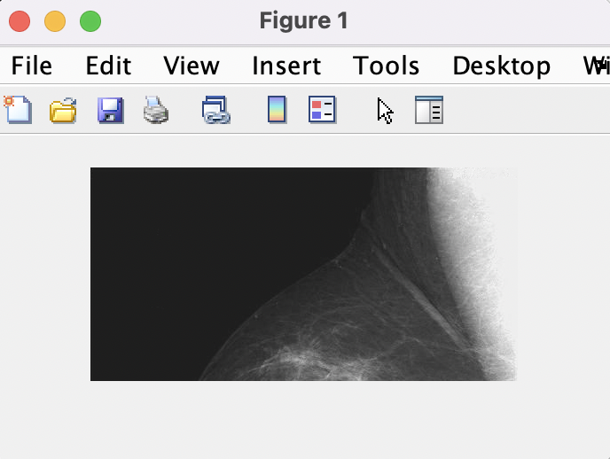</p><BR>


To find the maximum and minimum intensity values of the image, do this:
Input
```
[fmin, fmax] = bounds(f(:))
```

Output:
```
fmin =

  uint8

   21


fmax =

  uint8

   255
```

Since the data type for _f_ is _uint8_, the full intensity range is [0 255].  Is the intensity of _f_ close to the full range?
Yes-- the fmax is the max intensity given that 255 is the value.

**Test yourself**: Display the right half of the image. Capture it for your logbook.
Input
```
imshow(f(:,241:482))
```
Output
<p align="centre"></p><BR>

### Negative image

To compute the negative image and display both the original and the negative image side-by-side, do this:

Input
```
g1 = imadjust(f, [0 1], [1 0])
figure                          % open a new figure window
imshowpair(f, g1, 'montage')
```

Output
<p align="centre">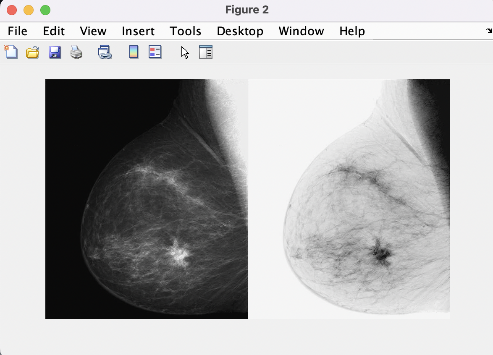</p><BR>

### Gamma correction

Input
```
g2 = imadjust(f, [0.5 0.75], [0 1]);
g3 = imadjust(f, [ ], [ ], 2);
figure
montage({g2,g3})
```
Output
<p align="center">  </p><BR>

## Task 2: Contrast-stretching transformation
Input
```
clear all       % clear all variables
close all       % close all figure windows
f = imread('assets/bonescan-front.tif');
r = double(f);  % uint8 to double conversion
k = mean2(r);   % find mean intensity of image
E = 0.9;
s = 1 ./ (1.0 + (k ./ (r + eps)) .^ E);
g = uint8(255*s);
imshowpair(f, g, "montage")
```
Output
<p align="center"></p><BR>

Discuss the results with your classmates and record your observations in your logbook.
- Main discussion was about utility for contast-lacking images, or where detail needs highlighted
- Causes distortion of image slightly and noise on png
- Causes some areas to be highlighted correctly, and others to be washed away

## Task 3: Contrast Enhancement using Histogram

### PLotting the histogram of an image

Input
```
clear all       % clear all variable in workspace
close all       % close all figure windows
f=imread('assets/pollen.tif');
imshow(f)
figure          % open a new figure window
imhist(f);      % calculate and plot the histogram
```
Output
<p align="center">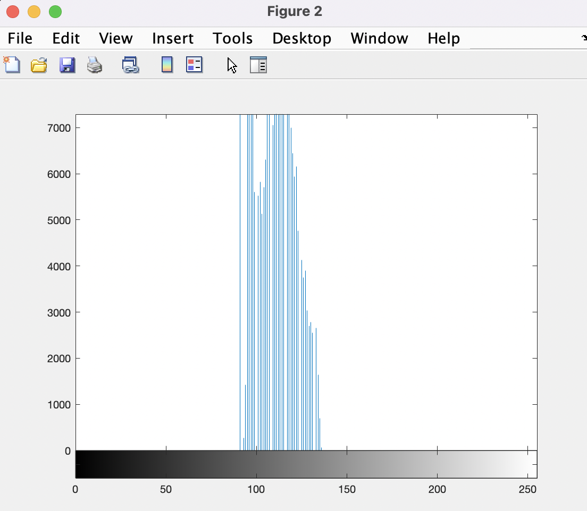</p><BR>

Input
```
close all
g=imadjust(f,[0.3 0.55]);
montage({f, g})     % display list of images side-by-side
figure
imhist(g);
```
Output
<p align="center"></p><BR>

### Histogram, PDF and CDF
Input
```
g_pdf = imhist(g) ./ numel(g);  % compute PDF
g_cdf = cumsum(g_pdf);          % compute CDF
close all                       % close all figure windows
imshow(g);
subplot(1,2,1)                  % plot 1 in a 1x2 subplot
plot(g_pdf)
subplot(1,2,2)                  % plot 2 in a 1x2 subplot
plot(g_cdf)
```
Output
<p align ="center"></p><BR>

### Histogram Equalization

Input
```
x = linspace(0, 1, 256);    % x has 256 values equally spaced
                            %  .... between 0 and 1
figure
plot(x, g_cdf)
axis([0 1 0 1])             % graph x and y range is 0 to 1
set(gca, 'xtick', 0:0.2:1)  % x tick marks are in steps of 0.2
set(gca, 'ytick', 0:0.2:1)
xlabel('Input intensity values', 'fontsize', 9)
ylabel('Output intensity values', 'fontsize', 9)
title('Transformation function', 'fontsize', 12)
```
Output
<p align = "center"></p><BR>

Input
```
h = histeq(g,256);              % histogram equalize g
close all
montage({f, g, h})
figure;
subplot(1,3,1); imhist(f);
subplot(1,3,2); imhist(g);
subplot(1,3,3); imhist(h);
```
Output
<p align = "center"></p><BR>
<p align = "center">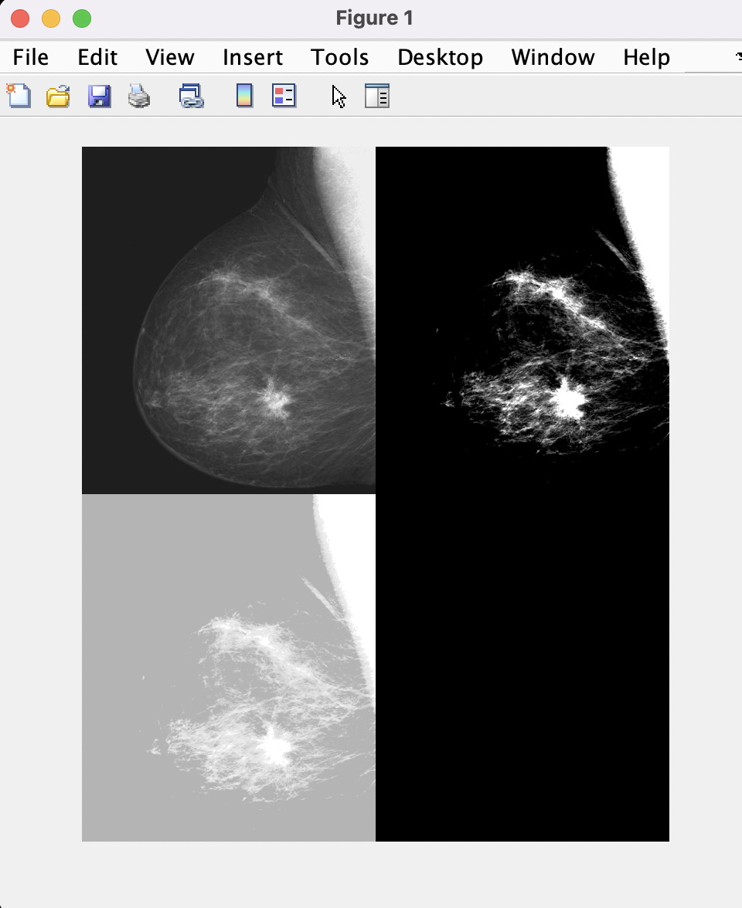</p><BR>


## Task 4 - Noise reduction with lowpass filter
Input
```
clear all
close all
f = imread('assets/noisyPCB.jpg');
imshow(f)
```
Output
<p align = "center">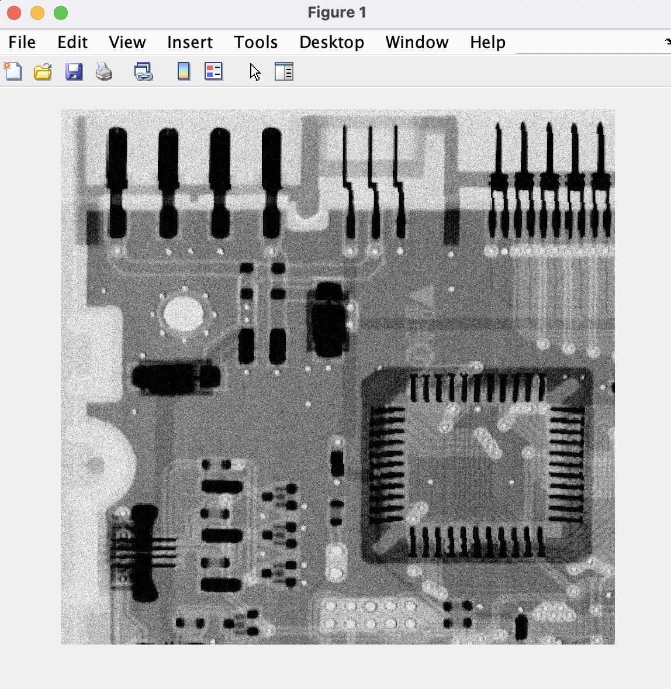</p><BR>

Input
```
w_box = fspecial('average', [9 9])
w_gauss = fspecial('Gaussian', [7 7], 1.0)
```

Output
<p align = "center"></p><BR>

```
w_box =

  Columns 1 through 4

    0.0123    0.0123    0.0123    0.0123
    0.0123    0.0123    0.0123    0.0123
    0.0123    0.0123    0.0123    0.0123
    0.0123    0.0123    0.0123    0.0123
    0.0123    0.0123    0.0123    0.0123
    0.0123    0.0123    0.0123    0.0123
    0.0123    0.0123    0.0123    0.0123
    0.0123    0.0123    0.0123    0.0123
    0.0123    0.0123    0.0123    0.0123

  Columns 5 through 8

    0.0123    0.0123    0.0123    0.0123
    0.0123    0.0123    0.0123    0.0123
    0.0123    0.0123    0.0123    0.0123
    0.0123    0.0123    0.0123    0.0123
    0.0123    0.0123    0.0123    0.0123
    0.0123    0.0123    0.0123    0.0123
    0.0123    0.0123    0.0123    0.0123
    0.0123    0.0123    0.0123    0.0123
    0.0123    0.0123    0.0123    0.0123

  Column 9

    0.0123
    0.0123
    0.0123
    0.0123
    0.0123
    0.0123
    0.0123
    0.0123
    0.0123


w_gauss =

  Columns 1 through 4

    0.0000    0.0002    0.0011    0.0018
    0.0002    0.0029    0.0131    0.0216
    0.0011    0.0131    0.0586    0.0966
    0.0018    0.0216    0.0966    0.1592
    0.0011    0.0131    0.0586    0.0966
    0.0002    0.0029    0.0131    0.0216
    0.0000    0.0002    0.0011    0.0018

  Columns 5 through 7

    0.0011    0.0002    0.0000
    0.0131    0.0029    0.0002
    0.0586    0.0131    0.0011
    0.0966    0.0216    0.0018
    0.0586    0.0131    0.0011
    0.0131    0.0029    0.0002
    0.0011    0.0002    0.0000

```

Input
```
g_box = imfilter(f, w_box, 0);
g_gauss = imfilter(f, w_gauss, 0);
figure
montage({f, g_box, g_gauss})
```
Output
<p align="center">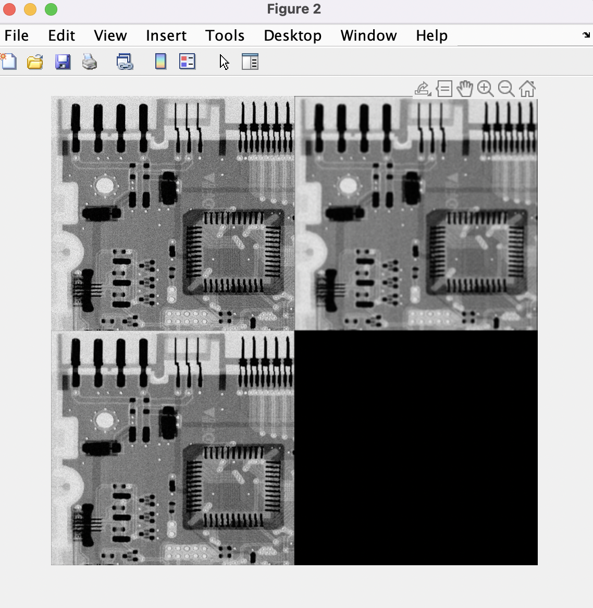</p><BR>

Comments:
- Box filter and gaussian both permit a noise reducing pass at the image, however gaussian is much softer
- Gaussian looks to have a stronger noise reduction
- Box and original have minimal difference in this state, however contrast and tone look more pronounced 
- Reducing the gaussian kernel to 1, and the box kernel raised to 25 creates this:
<p align="center"></p><BR>
- Raising the gaussian kernel to 17 and the box kernel to 5 creates this:
<p align ="center"></p><BR>
- Gaussia kernel at 7, but sigma at values 0.5, 1.0, 3.0, 4.5:
<p align="center">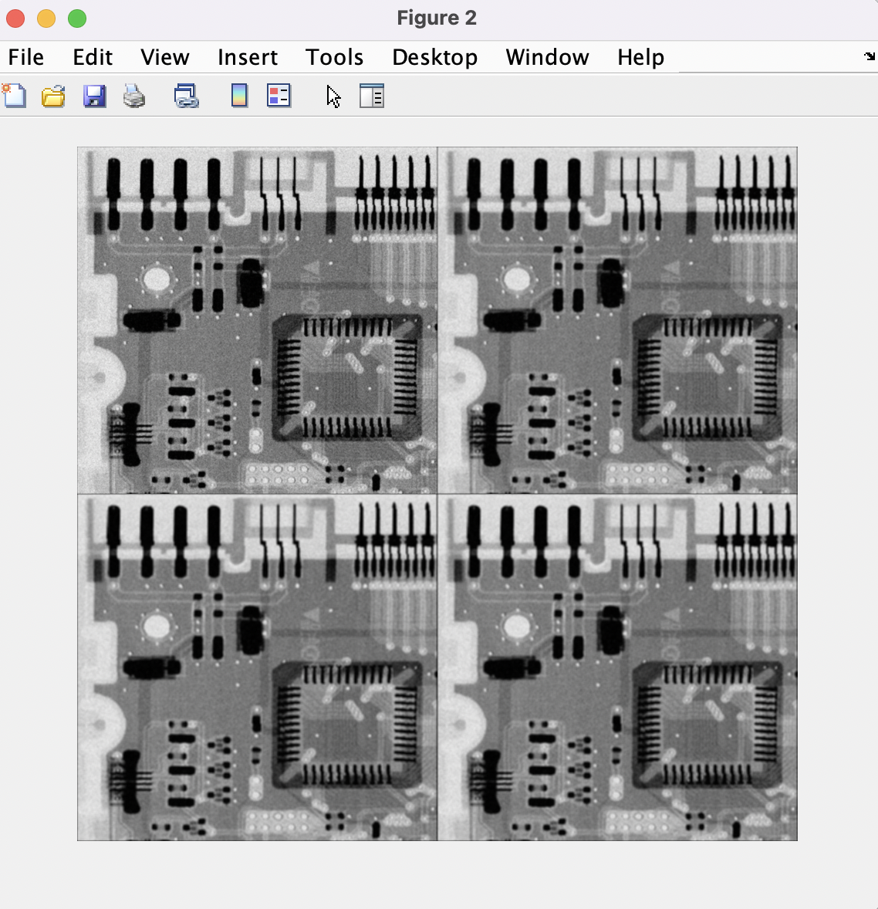</p><BR>
- It can be seen how (especially in gaussian) the kernel raising creates a softer image, trading off noise reduction for image contrast and clarity
-The sigma value change has slight differences, but less so then the kernel adjustment

## Task 5 - Median Filtering

Input
```
g_median = medfilt2(f, [7 7], 'zero');
figure; montage({f, g_median})
```
Output
<p align ="center"></p><BR>

Comments:
- Noise reduction traded again for image blur
- Grain is nearly gone

## Task 6 - Sharpening the image with Laplacian, Sobel and Unsharp filters
First, I tested all imspecial filters:

Input
```
f = imread('assets/moon.tif');
w_box = fspecial('average', [1 1])
w_disk = fspecial("disk",0.5)
w_lap = fspecial("laplacian", 0.1)
w_gauss = fspecial('Gaussian', [1 1], 1.0)
w_log = fspecial("log", [1000 1000], 0.5)
w_motion = fspecial("motion", 2, 0)
w_prew = fspecial("prewitt")
w_sobel = fspecial("sobel")
w_unsharp = fspecial("unsharp", 0.2)


g_box = imfilter(f, w_box, 0);
g_disk = imfilter(f,w_box,0);
g_lap = imfilter(f, w_lap,0);
g_gauss = imfilter(f, w_gauss, 0);
g_log = imfilter(f, w_log, 0);
g_motion = imfilter(f, w_motion, 0);
g_prew = imfilter(f, w_prew, 0);
g_sobel = imfilter(f, w_sobel, 0);
g_unsharp = imfilter(f, w_unsharp,0);

figure
montage({f, g_box, g_disk, g_lap, g_gauss, g_log, g_motion, g_prew, g_sobel, g_unsharp})
```

Output 
<p align = "center">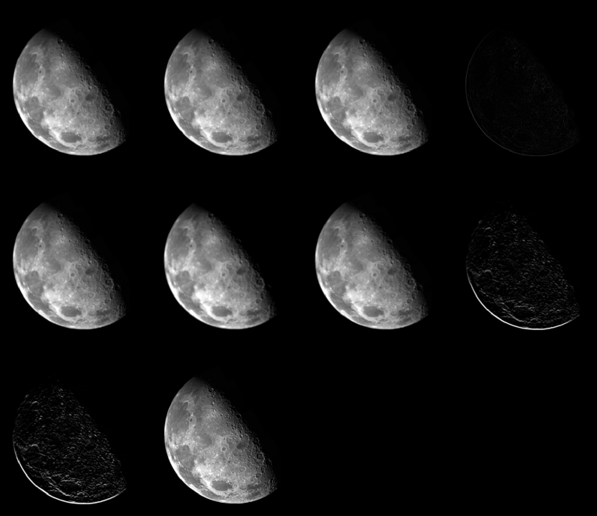</p><BR>

Then I noticed the most sharpening potentional (after playing around with values) in gaussian, disk, and box filters. This was my optimal outcomes:

Input
```
f = imread('assets/moon.tif');
w_box = fspecial('average', [1 1])
w_disk = fspecial("disk",0.2)
w_gauss = fspecial('Gaussian', [1 1], 0.5)

g_box = imfilter(f, w_box, 0);
g_disk = imfilter(f,w_box,0);
g_gauss = imfilter(f, w_gauss, 0);

figure
montage({f, g_box, g_disk, g_gauss})
```

Output
<p align = "center"></p><BR>

## Task 7 - Test yourself Challenges

* Improve the contrast of a lake and tree image store in file _lake&tree.png_
Input
```
f = imread("assets/lake&tree.png")
imshow(f)
      
g=imadjust(f,[0.15 0.45]);
montage({f, g}) 
```
Output
<p = align ="center"></p><BR>

* Use the Sobel filter in combination with any other techniques, find the edge of the circles in the image file _circles.tif_.
Input
```
f= imread("assets/circles.tif")
w_sobel = fspecial("sobel")
g_sobel = imfilter(f, w_sobel, 0);
w_prew = fspecial("prewitt")
g_prew = imfilter(g_sobel,w_prew,0);
montage({f,g_sobel, g_prew})
```

Output from just Sobel
<p = align ="center">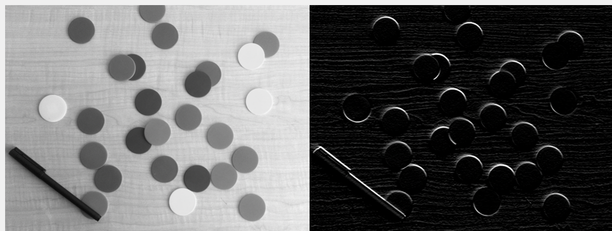</p><BR>

Output from Sobel + Prewitt
<p = align ="center">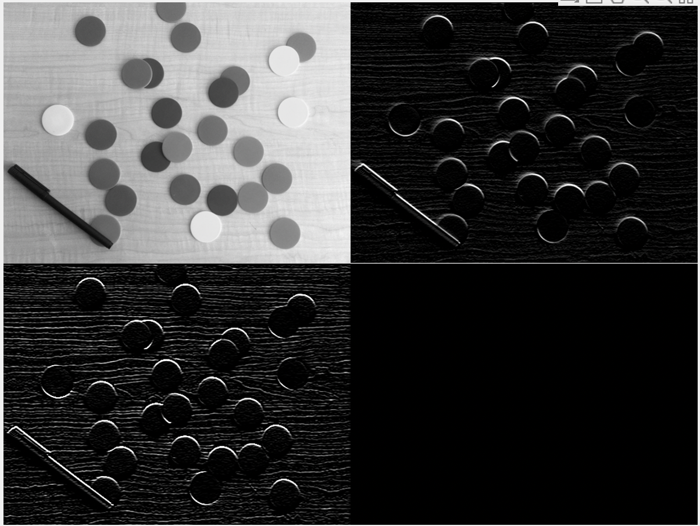</p><BR>

* _office.jpg_ is a colour photograph taken of an office with bad exposure.  Use whatever means at your disposal to improve the lighting and colour of this photo.
Input
```
f = imread("assets/office.jpg")
g=imadjust(f,[0.2 0.55]);

r = double(g);  
k = mean2(r);  
E = 2;
s = 1 ./ (1.0 + (k ./ (r + eps)) .^ E);
h = uint8(255*s);

w_gauss = fspecial("gaussian",[7 7], 1.0)
g_gauss = imfilter(h, w_gauss, 0);
w_box = fspecial("average",[2 2])
g_box = imfilter(g_gauss, w_box, 0);
montage({f, g, h, g_box})
```
Output
The four stages of this code, in montage:
<p = align ="center">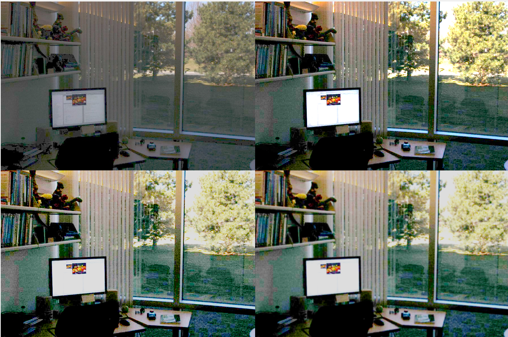</p><BR>


Full lab MatLab code:

```
clear all
imfinfo('assets/breastXray.tif')
f = imread('assets/breastXray.tif');
imshow(f)
f(3,10) %print pixel intensity
imshow(f(:,241:482))
[fmin, fmax] = bounds(f(:))
g1 = imadjust(f, [0 1], [1 0])
figure                          % open a new figure window
imshowpair(f, g1, 'montage')

g2 = imadjust(f, [0.5 0.75], [0 1]);
g3 = imadjust(f, [ ], [ ], 2);
figure
montage({g2,g3})

clear all       % clear all variables
close all       % close all figure windows
f = imread('assets/bonescan-front.tif');
r = double(f);  % uint8 to double conversion
k = mean2(r);   % find mean intensity of image
E = 0.9;
s = 1 ./ (1.0 + (k ./ (r + eps)) .^ E);
g = uint8(255*s);
imshowpair(f, g, "montage")

clear all       % clear all variable in workspace
close all       % close all figure windows
f=imread('assets/pollen.tif');
imshow(f)
figure          % open a new figure window
imhist(f);      % calculate and plot the histogram

close all
g=imadjust(f,[0.3 0.55]);
montage({f, g})     % display list of images side-by-side
figure
imhist(g);

g_pdf = imhist(g) ./ numel(g);  % compute PDF
g_cdf = cumsum(g_pdf);          % compute CDF
close all                       % close all figure windows
imshow(g);
subplot(1,2,1)                  % plot 1 in a 1x2 subplot
plot(g_pdf)
subplot(1,2,2)                  % plot 2 in a 1x2 subplot
plot(g_cdf)

x = linspace(0, 1, 256);    % x has 256 values equally spaced
                             .... between 0 and 1
figure
plot(x, g_cdf)
axis([0 1 0 1])             % graph x and y range is 0 to 1
set(gca, 'xtick', 0:0.2:1)  % x tick marks are in steps of 0.2
set(gca, 'ytick', 0:0.2:1)
xlabel('Input intensity values', 'fontsize', 9)
ylabel('Output intensity values', 'fontsize', 9)
title('Transformation function', 'fontsize', 12)

h = histeq(g,256);              % histogram equalize g
close all
montage({f, g, h})
figure;
subplot(1,3,1); imhist(f);
subplot(1,3,2); imhist(g);
subplot(1,3,3); imhist(h);
clear all
close all
f = imread('assets/noisyPCB.jpg');
imshow(f)

w_box = fspecial('average', [9 9])
w_gauss = fspecial('Gaussian', [7 7], 1.0)

g_box = imfilter(f, w_box, 0);
g_gauss = imfilter(f, w_gauss, 0);
figure
montage({f, g_box, g_gauss})

w_box = fspecial('average', [5 5])
w_gauss = fspecial('Gaussian', [7 7], 1.0)
e_gauss = fspecial('Gaussian', [7 7], 2.0)
r_gauss = fspecial('Gaussian', [7 7], 6.0)
t_gauss = fspecial('Gaussian', [7 7], 7.0)

g_box = imfilter(f, w_box, 0);
g_gauss = imfilter(f, w_gauss, 0);
h_gauss = imfilter(f, e_gauss, 0);
j_gauss = imfilter(f, r_gauss, 0);
k_gauss = imfilter(f, t_gauss, 0);
figure
montage({g_gauss, h_gauss, j_gauss, k_gauss})

g_median = medfilt2(f, [7 7], 'zero');
figure; montage({f, g_median})

f = imread('assets/moon.tif');
w_box = fspecial('average', [1 1])
w_disk = fspecial("disk",0.5)
w_lap = fspecial("laplacian", 0.1)
w_gauss = fspecial('Gaussian', [1 1], 1.0)
w_log = fspecial("log", [1000 1000], 0.5)
w_motion = fspecial("motion", 2, 0)
w_prew = fspecial("prewitt")
w_sobel = fspecial("sobel")
w_unsharp = fspecial("unsharp", 0.2)


g_box = imfilter(f, w_box, 0);
g_disk = imfilter(f,w_box,0);
g_lap = imfilter(f, w_lap,0);
g_gauss = imfilter(f, w_gauss, 0);
g_log = imfilter(f, w_log, 0);
g_motion = imfilter(f, w_motion, 0);
g_prew = imfilter(f, w_prew, 0);
g_sobel = imfilter(f, w_sobel, 0);
g_unsharp = imfilter(f, w_unsharp,0);

figure
montage({f, g_box, g_disk, g_lap, g_gauss, g_log, g_motion, g_prew, g_sobel, g_unsharp})

f = imread('assets/moon.tif');
w_box = fspecial('average', [1 1])
w_disk = fspecial("disk",0.2)
w_gauss = fspecial('Gaussian', [1 1], 0.5)

g_box = imfilter(f, w_box, 0);
g_disk = imfilter(f,w_box,0);
g_gauss = imfilter(f, w_gauss, 0);

figure
montage({f, g_box, g_disk, g_gauss})

f = imread("assets/lake&tree.png")
imshow(f)

g=imadjust(f,[0.15 0.45]);
montage({f, g})     

r = double(g);  
k = mean2(r);  
E = 2;
s = 1 ./ (1.0 + (k ./ (r + eps)) .^ E);
h = uint8(255*s);
imshowpair(g, h, "montage")

f= imread("assets/circles.tif")
w_sobel = fspecial("sobel")
g_sobel = imfilter(f, w_sobel, 0);
w_prew = fspecial("prewitt")
g_prew = imfilter(g_sobel,w_prew,0);
montage({f,g_sobel, g_prew})

f = imread("assets/office.jpg")
g=imadjust(f,[0.2 0.55]);

r = double(g);  
k = mean2(r);  
E = 2;
s = 1 ./ (1.0 + (k ./ (r + eps)) .^ E);
h = uint8(255*s);

w_gauss = fspecial("gaussian",[7 7], 1.0)
g_gauss = imfilter(h, w_gauss, 0);
w_box = fspecial("average",[2 2])
g_box = imfilter(g_gauss, w_box, 0);
montage({f, g, h, g_box}) 

```