# Lab 3 - Intensity Transformation and Spatial Filtering
## Amy Brons - Design of Visual Systems
Below is the logbook for Lab 3, and the full MATLAB code for this lab can be found in attached MATLAB file.

## Task 1 - Contrast enhancement with function imadjust

### Importing an image

Check what is on image file *_breastXray.tif_* stored in the assets folder and read the image data into the matrix *_f_*, and display it:

Input
```
clear all
imfinfo('assets/breastXray.tif')
f = imread('assets/breastXray.tif');
imshow(f)
```

Output
<p align = "center">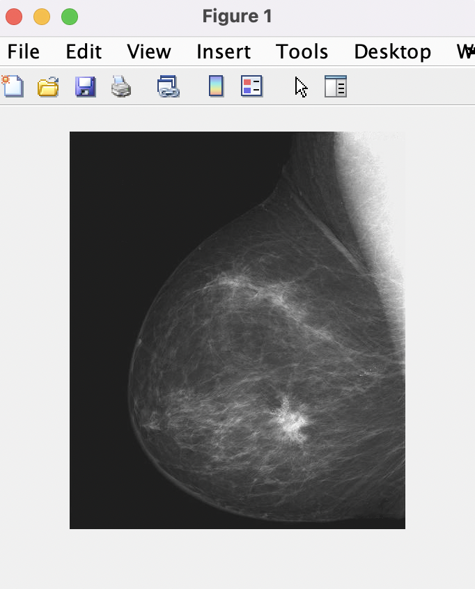</p><BR>
<BR><BR>
Check the dimension of _f_ on the right window pane of Matlab. Examine the image data stored:

Input
```
f(3,10)            
imshow(f(1:241,:)) 
```

Output
<p align = "center">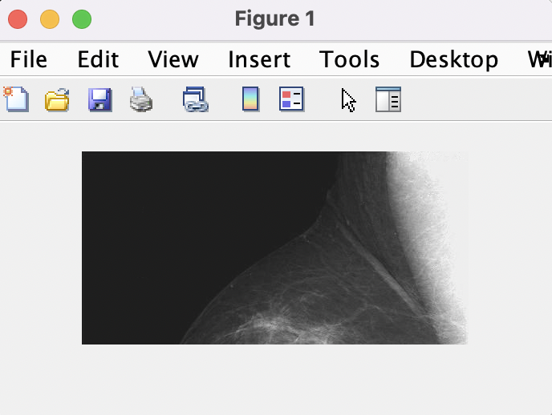</p><BR>

<BR><BR>
To find the maximum and minimum intensity values of the image, do this:
Input
```
[fmin, fmax] = bounds(f(:))
```

Output:
```
fmin =

  uint8

   21


fmax =

  uint8

   255
```
<BR><BR>
Since the data type for _f_ is _uint8_, the full intensity range is [0 255].  Is the intensity of _f_ close to the full range?:
Yes-- the fmax is the max intensity given that 255 is the value.
<BR><BR>

## Test yourself
Display the right half of the image:
Input
```
imshow(f(:,241:482))
```
Output
<p align="centre">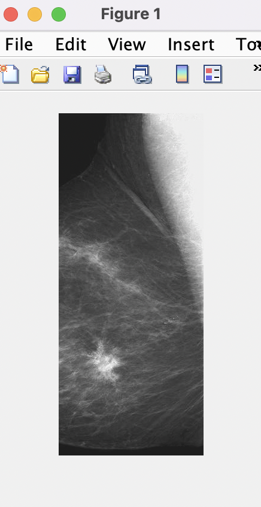</p><BR>
<BR><BR>

### Negative image

To compute the negative image and display both the original and the negative image side-by-side, do this:

Input
```
g1 = imadjust(f, [0 1], [1 0])
figure                         
imshowpair(f, g1, 'montage')
```

Output
<p align="centre">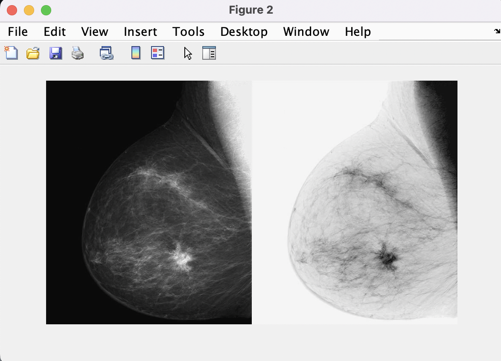</p><BR>
<BR><BR>

### Gamma correction

Input
```
g2 = imadjust(f, [0.5 0.75], [0 1]);
g3 = imadjust(f, [ ], [ ], 2);
figure
montage({g2,g3})
```

Output
<p align="center"> 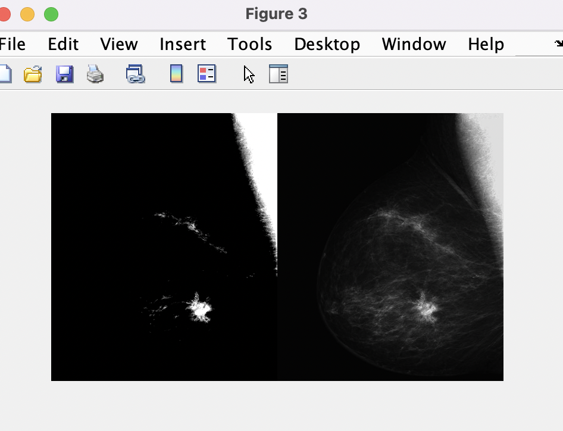 </p><BR>
<BR><BR>

## Task 2: Contrast-stretching transformation
Instead of using the imadjust function, we will apply the constrast stretching transformation function:

Input
```
f = imread('assets/bonescan-front.tif');
r = double(f);  
k = mean2(r); 
E = 0.9;
s = 1 ./ (1.0 + (k ./ (r + eps)) .^ E);
g = uint8(255*s);
imshowpair(f, g, "montage")
```

Output
<p align="center">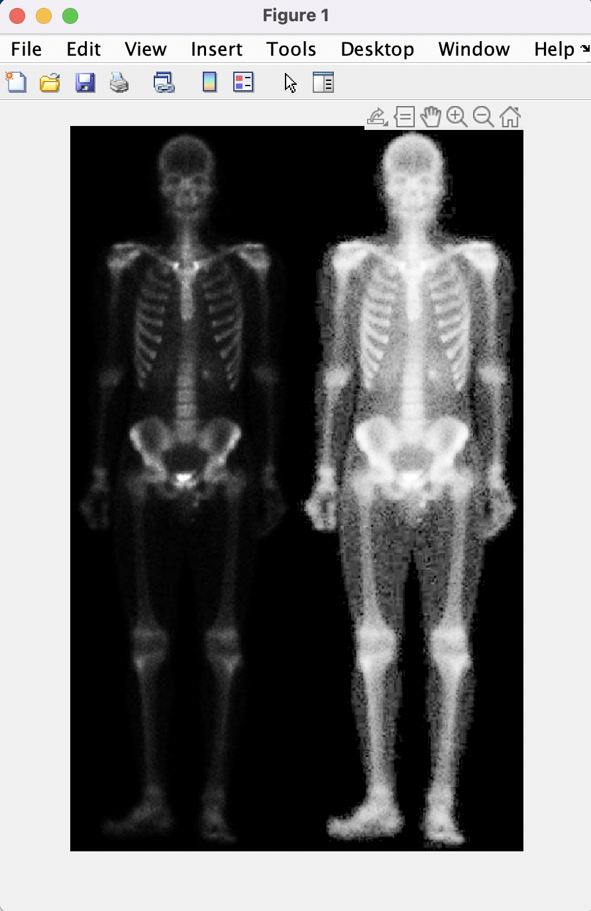</p><BR>

Discuss the results with your classmates and record your observations in your logbook.
- Main discussion was about utility for contast-lacking images, or where detail needs highlighted
- Causes distortion of image slightly and noise on png
- Causes some areas to be highlighted correctly, and others to be washed away
<BR><BR>

## Task 3: Contrast Enhancement using Histogram

### Plotting the histogram of an image
Matlab has a built-in function imhist to compute the histogram of an image and plot it:

Input
```
f=imread('assets/pollen.tif');
imshow(f)
figure         
imhist(f);    
```

Output
<p align="center">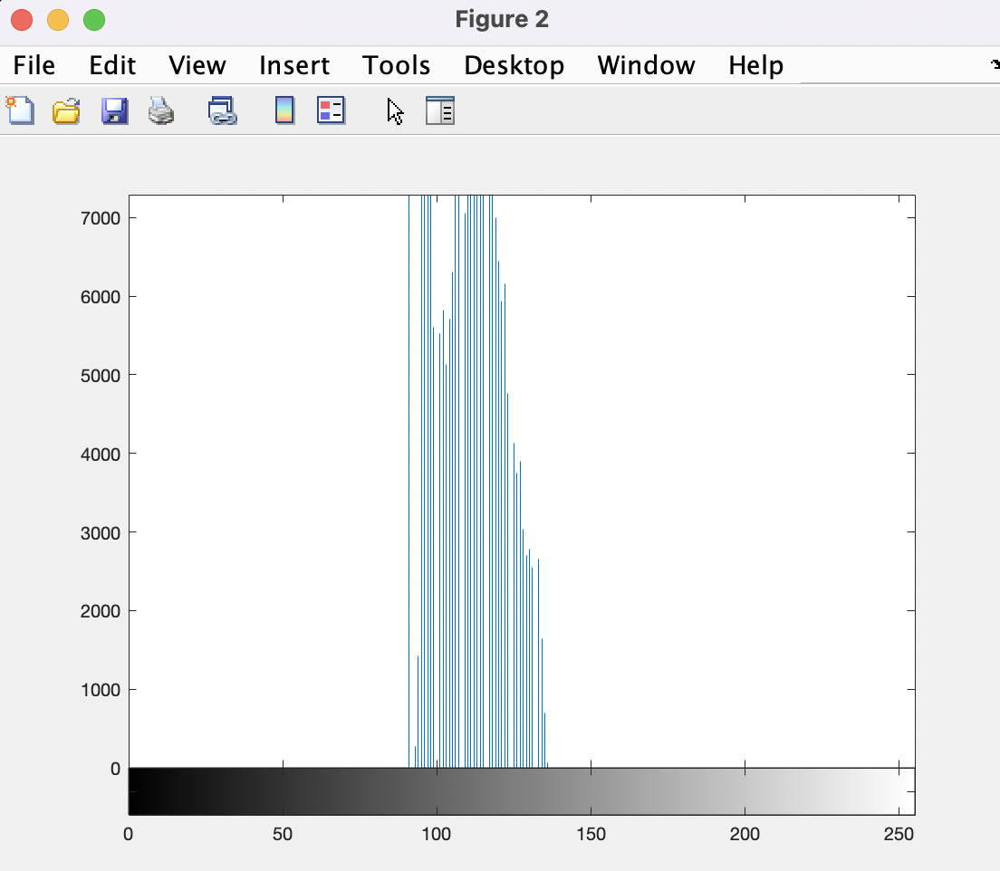</p><BR>
<BR><BR>

One attempt is to stretch the intensity between 0.3 and 0.55 of full scale (i.e. 255) with the built-in function imadjust from the previous tasks:

Input
```
close all
g=imadjust(f,[0.3 0.55]);
montage({f, g})    
figure
imhist(g);
```

Output
<p align="center">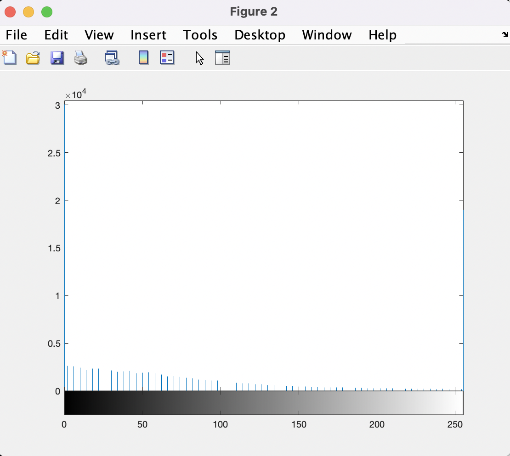</p><BR>

<BR><BR>

### Histogram, PDF and CDF
The following code computs the PDF and CDF for the adjusted image g, and plot them side-by-side in a single figure. The function subplot(m, n, p) specifies which subplot is to be used:
Input
```
g_pdf = imhist(g) ./ numel(g);
g_cdf = cumsum(g_pdf);         
close all                      
imshow(g);
subplot(1,2,1)                  
plot(g_pdf)
subplot(1,2,2)                 
plot(g_cdf)
```

Output
<p align ="center">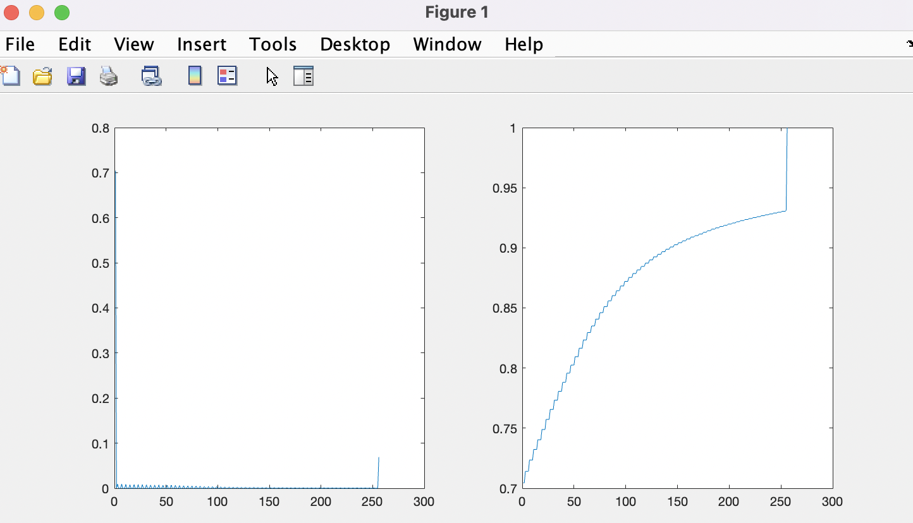</p><BR>

### Histogram Equalization
The following code replot the CDF and make it looks pretty. It is also an opportunity to demonstrate some of Matlab's plotting capabilities:
Input
```
x = linspace(0, 1, 256);    
figure
plot(x, g_cdf)
axis([0 1 0 1])            
set(gca, 'xtick', 0:0.2:1) 
set(gca, 'ytick', 0:0.2:1)
xlabel('Input intensity values', 'fontsize', 9)
ylabel('Output intensity values', 'fontsize', 9)
title('Transformation function', 'fontsize', 12)
```

Output
<p align = "center">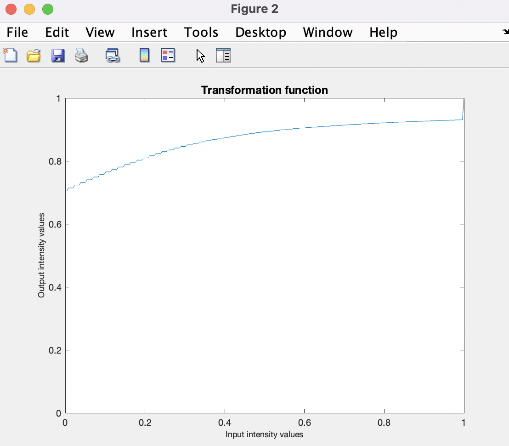</p><BR>
<BR><BR>

The Matlab function histeq computes the CDF of an image, and use this as the intensity transformation function to flatten the histogram. The following code will perform this function and provide plots of all three images and their histogram:

Input
```
h = histeq(g,256);              
close all
montage({f, g, h})
figure;
subplot(1,3,1); imhist(f);
subplot(1,3,2); imhist(g);
subplot(1,3,3); imhist(h);
```

Output

<p align = "center">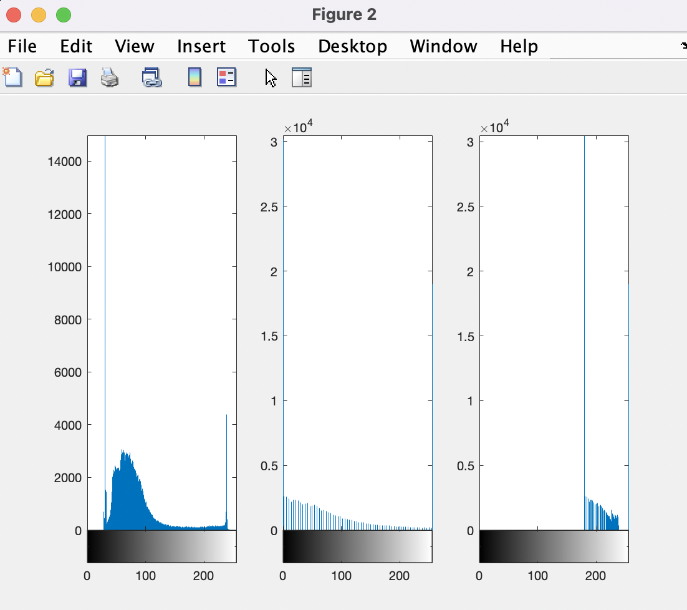</p><BR>
<p align = "center"></p><BR>

<BR><BR>

## Task 4 - Noise reduction with lowpass filter
The table below shows the types of kernels that can generated.
<p align = "center">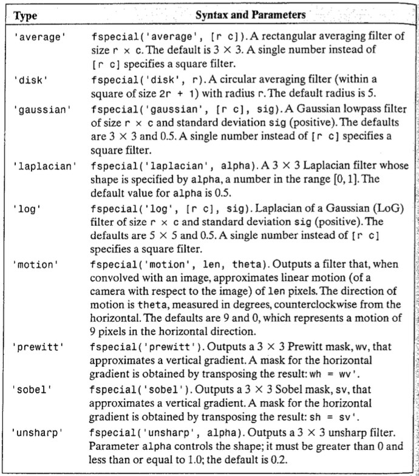</p><BR>

Import an X-ray image of a printed circuit board:
Input
```
clear all
close all
f = imread('assets/noisyPCB.jpg');
imshow(f)
```
Output
<p align = "center">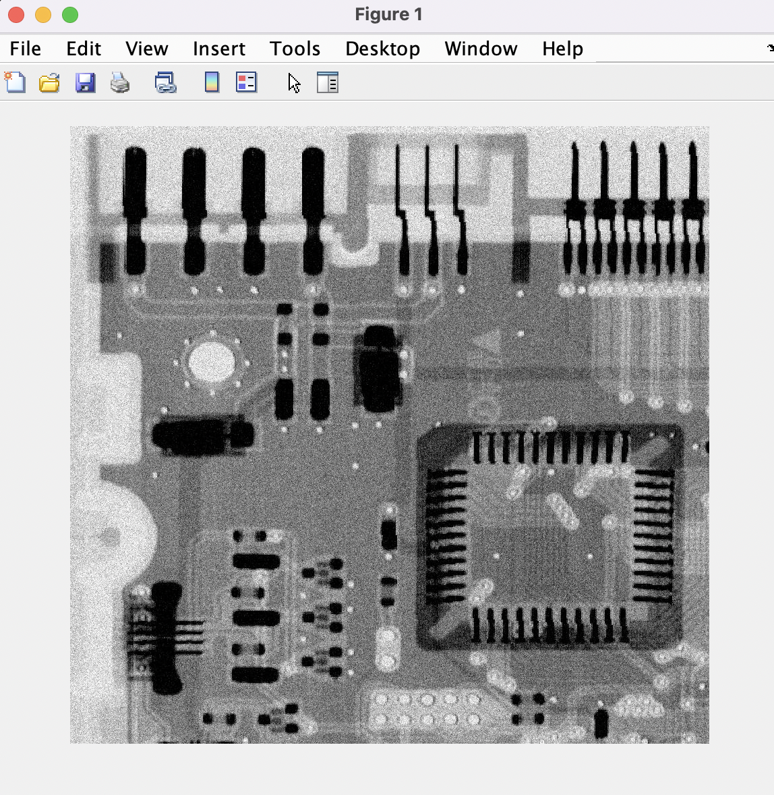</p><BR>
<BR><BR>

Use the function fspecial to produce a 9x9 averaging filter kernel _ and a 7 x 7 Gaussian kernel with sigma = 0.5 as shown below:
Input
```
w_box = fspecial('average', [9 9])
w_gauss = fspecial('Gaussian', [7 7], 1.0)
```

Output
<p align = "center">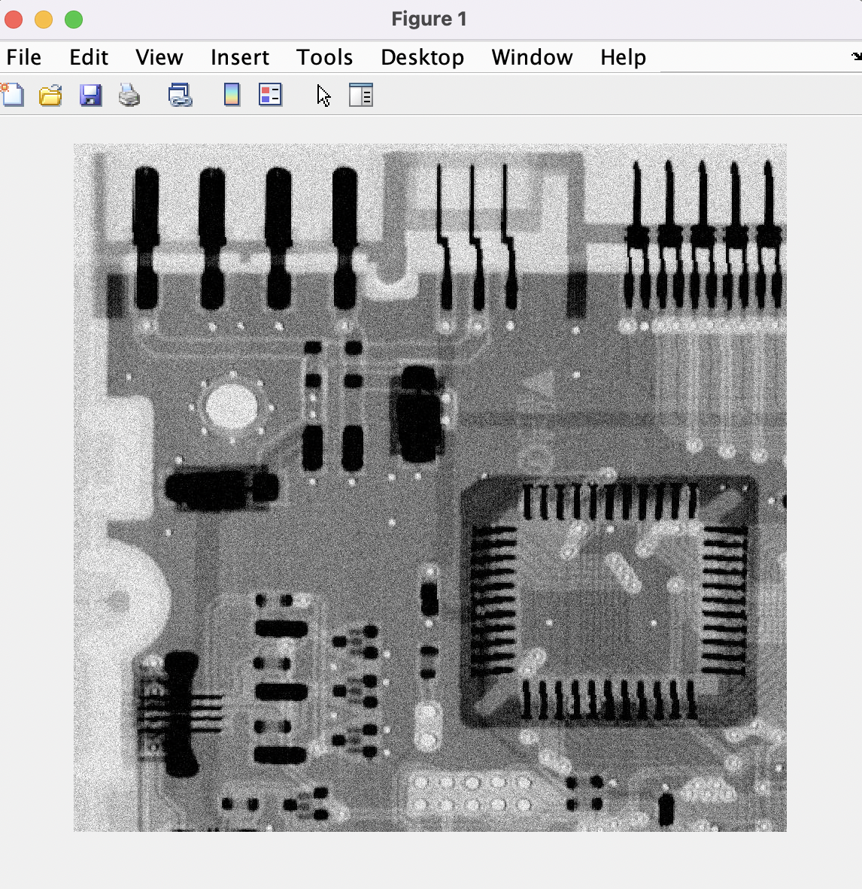</p><BR>

```
w_box =

  Columns 1 through 4

    0.0123    0.0123    0.0123    0.0123
    0.0123    0.0123    0.0123    0.0123
    0.0123    0.0123    0.0123    0.0123
    0.0123    0.0123    0.0123    0.0123
    0.0123    0.0123    0.0123    0.0123
    0.0123    0.0123    0.0123    0.0123
    0.0123    0.0123    0.0123    0.0123
    0.0123    0.0123    0.0123    0.0123
    0.0123    0.0123    0.0123    0.0123

  Columns 5 through 8

    0.0123    0.0123    0.0123    0.0123
    0.0123    0.0123    0.0123    0.0123
    0.0123    0.0123    0.0123    0.0123
    0.0123    0.0123    0.0123    0.0123
    0.0123    0.0123    0.0123    0.0123
    0.0123    0.0123    0.0123    0.0123
    0.0123    0.0123    0.0123    0.0123
    0.0123    0.0123    0.0123    0.0123
    0.0123    0.0123    0.0123    0.0123

  Column 9

    0.0123
    0.0123
    0.0123
    0.0123
    0.0123
    0.0123
    0.0123
    0.0123
    0.0123


w_gauss =

  Columns 1 through 4

    0.0000    0.0002    0.0011    0.0018
    0.0002    0.0029    0.0131    0.0216
    0.0011    0.0131    0.0586    0.0966
    0.0018    0.0216    0.0966    0.1592
    0.0011    0.0131    0.0586    0.0966
    0.0002    0.0029    0.0131    0.0216
    0.0000    0.0002    0.0011    0.0018

  Columns 5 through 7

    0.0011    0.0002    0.0000
    0.0131    0.0029    0.0002
    0.0586    0.0131    0.0011
    0.0966    0.0216    0.0018
    0.0586    0.0131    0.0011
    0.0131    0.0029    0.0002
    0.0011    0.0002    0.0000

```
<BR><BR>
Now, apply the filter to the image with:

Input
```
g_box = imfilter(f, w_box, 0);
g_gauss = imfilter(f, w_gauss, 0);
figure
montage({f, g_box, g_gauss})
```

Output
<p align="center">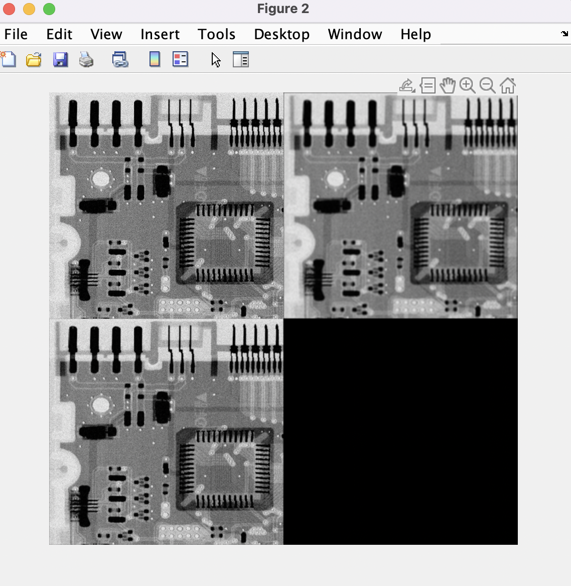</p><BR>
<BR><BR>

Comments:
- Box filter and gaussian both permit a noise reducing pass at the image, however gaussian is much softer
- Gaussian looks to have a stronger noise reduction
- Box and original have minimal difference in this state, however contrast and tone look more pronounced 
- Reducing the gaussian kernel to 1, and the box kernel raised to 25 creates this:
<p align="center">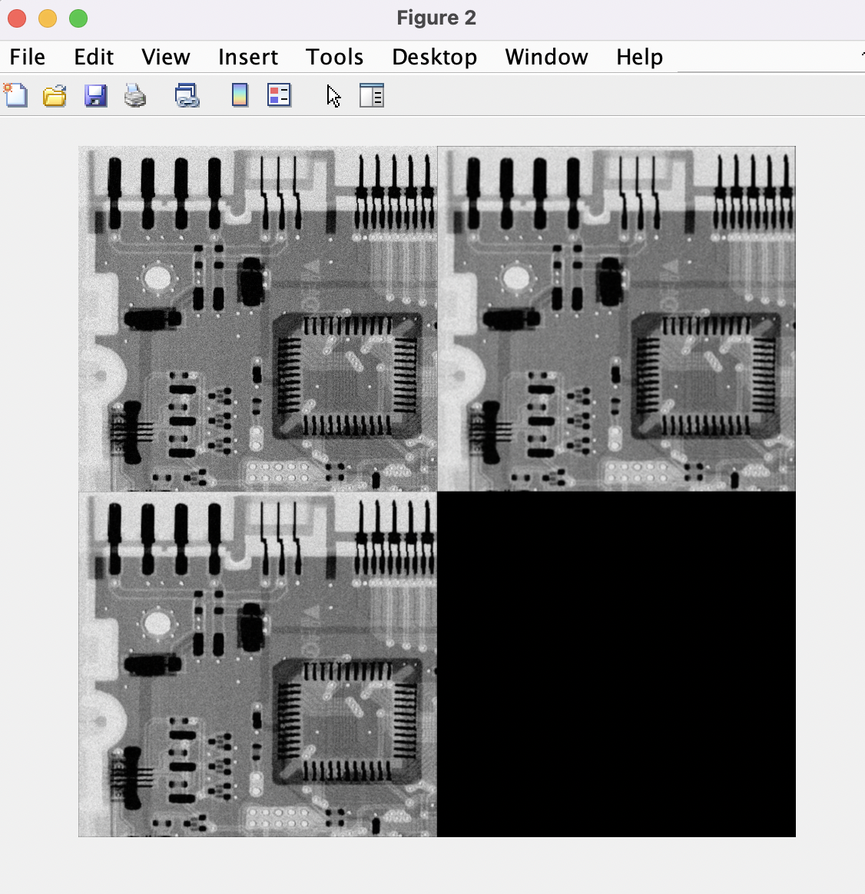</p><BR>
- Raising the gaussian kernel to 17 and the box kernel to 5 creates this:
<p align ="center">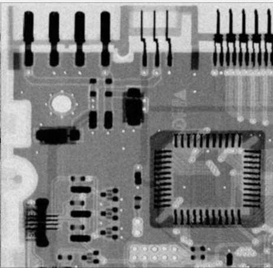</p><BR>
- Gaussia kernel at 7, but sigma at values 0.5, 1.0, 3.0, 4.5:
<p align="center">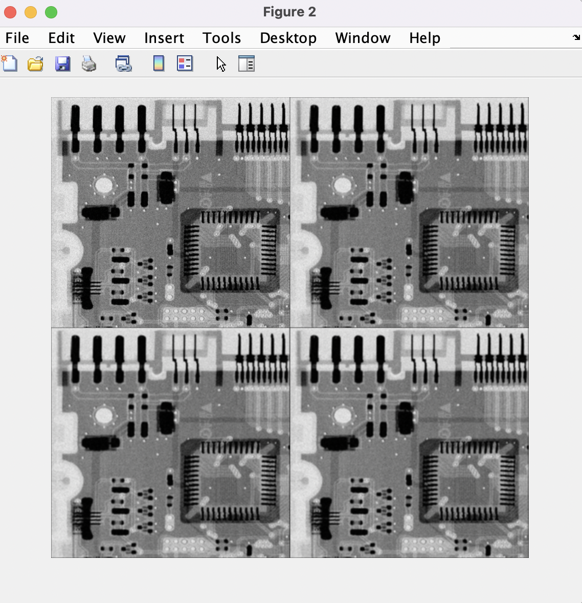</p><BR>
- It can be seen how (especially in gaussian) the kernel raising creates a softer image, trading off noise reduction for image contrast and clarity
-The sigma value change has slight differences, but less so then the kernel adjustment
<BR><BR>

## Task 5 - Median Filtering
 Median filter provides a better solution if sharpness is to be preserved.

Input
```
g_median = medfilt2(f, [7 7], 'zero');
figure; montage({f, g_median})
```

Output
<p align ="center">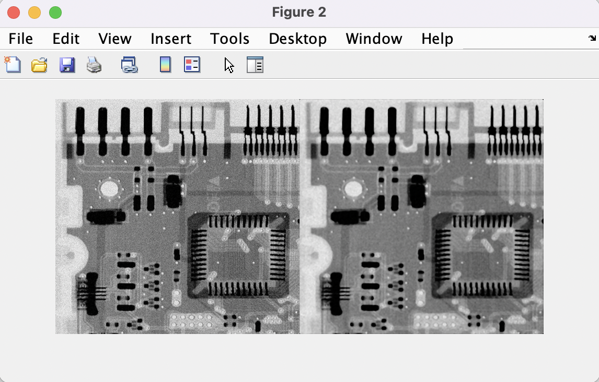</p><BR>
<BR><BR>

Comments:
- Noise reduction traded again for image blur
- Grain is nearly gone
<BR><BR>

## Task 6 - Sharpening the image with Laplacian, Sobel and Unsharp filters
First, I tested all imspecial filters:

Input
```
f = imread('assets/moon.tif');
w_box = fspecial('average', [1 1])
w_disk = fspecial("disk",0.5)
w_lap = fspecial("laplacian", 0.1)
w_gauss = fspecial('Gaussian', [1 1], 1.0)
w_log = fspecial("log", [1000 1000], 0.5)
w_motion = fspecial("motion", 2, 0)
w_prew = fspecial("prewitt")
w_sobel = fspecial("sobel")
w_unsharp = fspecial("unsharp", 0.2)


g_box = imfilter(f, w_box, 0);
g_disk = imfilter(f,w_box,0);
g_lap = imfilter(f, w_lap,0);
g_gauss = imfilter(f, w_gauss, 0);
g_log = imfilter(f, w_log, 0);
g_motion = imfilter(f, w_motion, 0);
g_prew = imfilter(f, w_prew, 0);
g_sobel = imfilter(f, w_sobel, 0);
g_unsharp = imfilter(f, w_unsharp,0);

figure
montage({f, g_box, g_disk, g_lap, g_gauss, g_log, g_motion, g_prew, g_sobel, g_unsharp})
```

Output 
<p align = "center">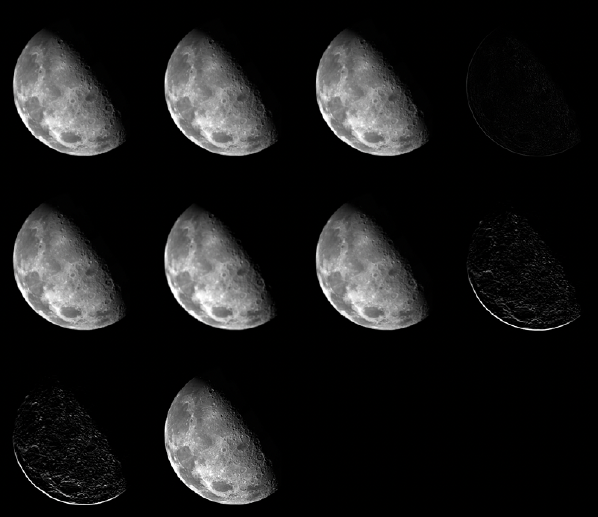</p><BR>

Then I noticed the most sharpening potentional (after playing around with values) in gaussian, disk, and box filters. This was my optimal outcomes:

Input
```
f = imread('assets/moon.tif');
w_box = fspecial('average', [1 1])
w_disk = fspecial("disk",0.2)
w_gauss = fspecial('Gaussian', [1 1], 0.5)

g_box = imfilter(f, w_box, 0);
g_disk = imfilter(f,w_box,0);
g_gauss = imfilter(f, w_gauss, 0);

figure
montage({f, g_box, g_disk, g_gauss})
```

Output
<p align = "center">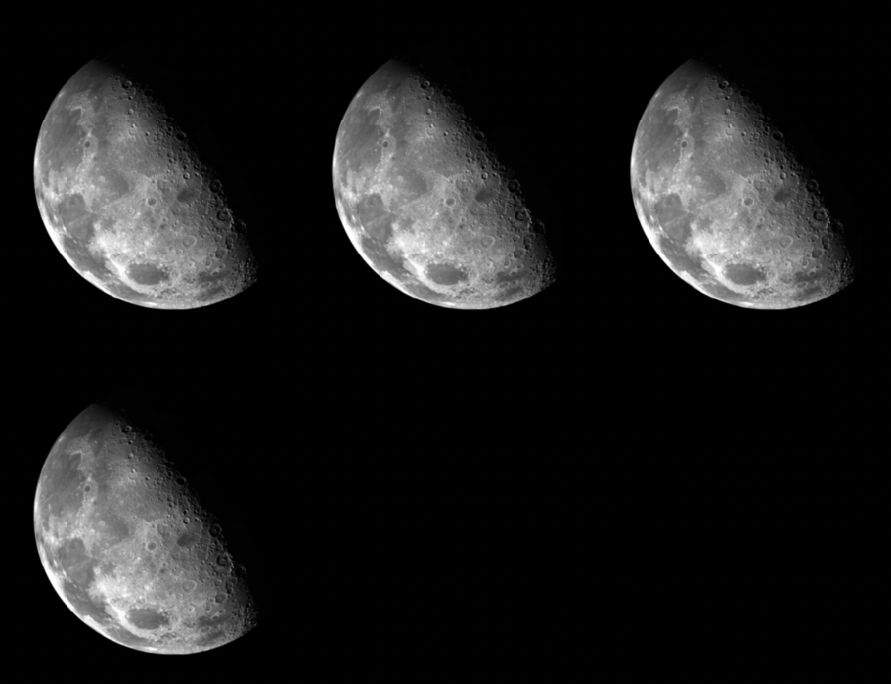</p><BR>

## Task 7 - Test yourself Challenges

Improve the contrast of a lake and tree image store in file _lake&tree.png_
<BR>
Input
```
f = imread("assets/lake&tree.png")
imshow(f)
g=imadjust(f,[0.15 0.45]);
montage({f, g})     
r = double(g);  
k = mean2(r);  
E = 2;
s = 1 ./ (1.0 + (k ./ (r + eps)) .^ E);
h = uint8(255*s);
imwrite(h,"lake&tree.png")
montage({f,g,h})
```

Output
<p align ="center">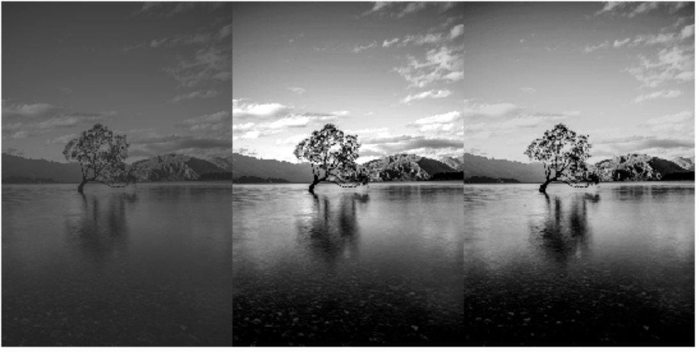</p><BR>
<BR><BR>

Use the Sobel filter in combination with any other techniques, find the edge of the circles in the image file _circles.tif_.
<BR>
Input
```
f= imread("assets/circles.tif")
w_sobel = fspecial("sobel")
g_sobel = imfilter(f, w_sobel, 0);
w_prew = fspecial("prewitt")
g_prew = imfilter(g_sobel,w_prew,0);
montage({f,g_sobel, g_prew})
```

Output from just Sobel
<p align ="center">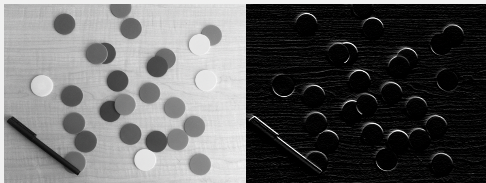</p><BR>

Output from Sobel + Prewitt
<p align ="center">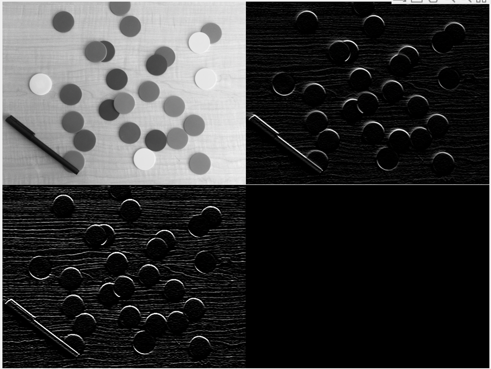</p><BR>

<BR><BR>
_office.jpg_ is a colour photograph taken of an office with bad exposure.  Use whatever means at your disposal to improve the lighting and colour of this photo.
<BR>
Input
```
f = imread("assets/office.jpg")
g=imadjust(f,[0.2 0.55]);

r = double(g);  
k = mean2(r);  
E = 2;
s = 1 ./ (1.0 + (k ./ (r + eps)) .^ E);
h = uint8(255*s);

w_gauss = fspecial("gaussian",[7 7], 1.0)
g_gauss = imfilter(h, w_gauss, 0);
w_box = fspecial("average",[2 2])
g_box = imfilter(g_gauss, w_box, 0);
montage({f, g, h, g_box})
```
Output
The four stages of this code, in montage:
<p align ="center">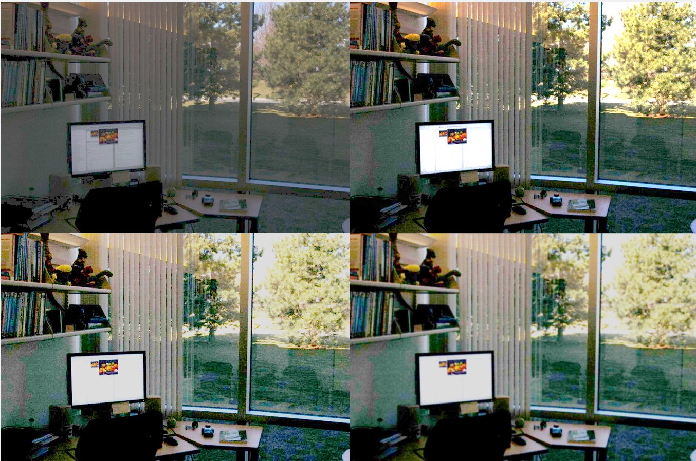</p><BR>